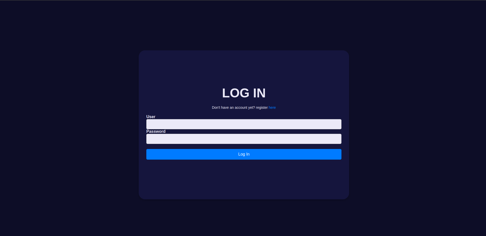
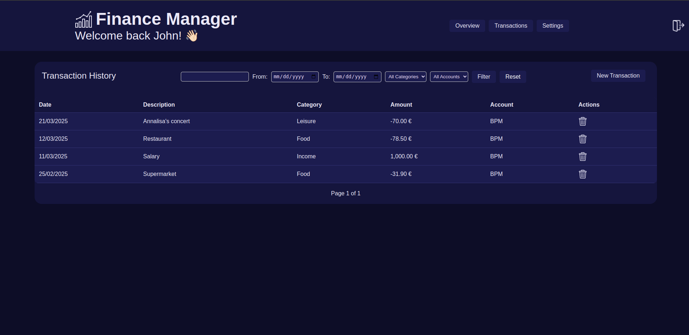
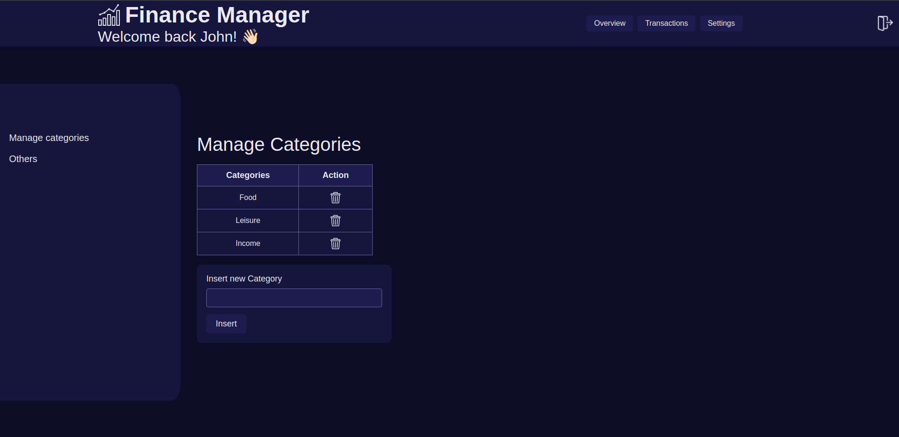

# Finance Manager SAAS
## Introduction

My finance manager is built using HTML, CSS, JavaScript, PHP, and SQL (MariaDB), which I am currently studying at school. I used to manage my finances with a Google Spreadsheet, but I didn’t like it, so I created my own web application.

The application is fully functional with its main features, but I plan to add more (see the to-do page).

This project is made for personal use. While I have implemented some security precautions, I cannot guarantee complete safety.

## Main features

### Login, logout and register

Although this project is for personal use, I included a login management system to ensure that if someone gains access to my computer, they still need to log in to view my data. Every page includes a logout button in the upper right corner.

There is also a registration page, but I only used it once. Every internal page has a login check, so even if someone tries to access a page by typing its URL in the browser’s address bar, they won’t be able to open it without logging in first.

### Dashboard page

The dashboard is the main page, acting as a statistics and summary section. It features four types of graphs (spline, column, pie, and donut) to display transactions and categories in different ways.

The page includes filters for the displayed data, allowing users to filter by date (defaulting to the current year), category, and account.

Above the graphs, three summary boxes display total income, total expenses, and the difference between them.

### Transactions page

This page presents transactions in a table format, with the same filtering options as the dashboard page. Each transaction can be deleted using a trash bin button on the right side of the record.

In the top-right corner, there is also a button to open the form for adding a new transaction.

### Settings page

The settings page is currently very basic, with its main and only feature being category management. Categories are dynamic, so users can add or delete them at any time.

### Credit

- Original graphs’ code: https://canvasjs.com/php-charts/
- Graphic inspiration from this video (not the code, just graphic): https://www.youtube.com/watch?v=N_uNKAus0II&t=278s&pp=ygUNZmluYW5jZSBzYWFzIA%3D%3D
